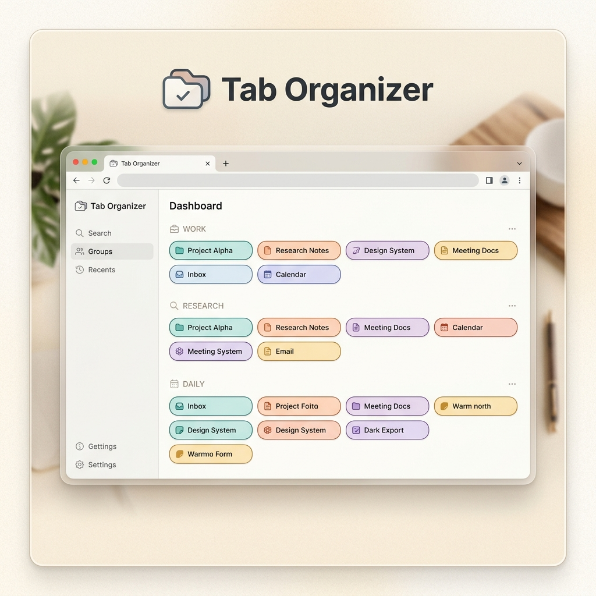

<div align="center">
  

  # Tab Organizer
  
  **The Local-First Dashboard for Your Browser Tabs.**

  [](https://opensource.org/licenses/MIT)
  []()
  []()

  [English](#english) | [中文说明](#chinese) | [Original Project ↗️](https://github.com/OWENLEEzy/tab-out)

</div>

---

<a name="english"></a>

## ✨ The Vision

Tab Organizer is a premium Chrome extension designed to declutter your digital workspace. It transforms your messy tab bar into a clean, Notion-inspired dashboard where tabs are automatically grouped by product and domain.

No servers, no accounts, no tracking. **100% local, 100% private.**

> [!TIP]
> **New to Tab Organizer?** Check out our **[Interactive Tutorial](https://owenleezy.github.io/tab-organizer/tutorial.html)** and master it in 60 seconds!

---

## 🚀 Quick Installation

1. Go to the **[Releases](https://github.com/OWENLEEzy/tab-organizer/releases)** page.
2. Download the latest **`tab-organizer-v[version].zip`**.
3. Extract the ZIP file locally.
4. Open Chrome and navigate to `chrome://extensions`.
5. Enable **Developer mode**.
6. Click **Load unpacked** and select the `dist` folder.

---

## 💎 Features

- **Automated Grouping**: Tabs are intelligently grouped by domain.
- **Homepages Cluster**: Centralizes your Gmail, X, LinkedIn, and GitHub homepages into a single elegant card.
- **Localhost Intelligence**: Perfect for developers—shows port numbers so you can distinguish between different "Vibe Coding" projects.
- **Satisfying Cleanup**: Close tabs with a delightful *swoosh* sound and a burst of confetti.
- **Duplicate Detection**: Instantly identifies and cleans up redundant tabs with one click.
- **Keyboard Mastery**: Full search and keyboard navigation across all visible tabs.
- **Snapshot Recovery**: Lightweight local safety—restore recent sessions without external sync.

---

## 🛠️ Developer Setup

If you want to build from source or contribute:

```bash
# Clone the repository
git clone https://github.com/OWENLEEzy/tab-organizer.git
cd tab-organizer

# Install dependencies
npm install

# Build the project
npm run build
```

Once built, load the `dist/` folder in `chrome://extensions`.

---

<a name="chinese"></a>

## 🏮 中文说明

### 🌟 核心理念
Tab Organizer 是一款专为高效办公设计的 Chrome 扩展程序。它将凌乱的标签栏转化为一个受 Notion 启发的清新看板，自动按域名对标签进行归类。

**完全本地运行：** 无服务器、无账户、无外部 API 调用。您的隐私就是我们的首要任务。

> [!IMPORTANT]
> **第一次使用？** 强烈建议查看我们的 **[交互式使用教程](https://owenleezy.github.io/tab-organizer/tutorial.html)**，只需 1 分钟即可上手。

### 🚀 快速安装
1. 前往 **[Releases](https://github.com/OWENLEEzy/tab-organizer/releases)** 页面。
2. 下载最新的 **`tab-organizer-v[版本号].zip`** 文件。
3. 在本地解压该文件。
4. 打开 Chrome，进入 `chrome://extensions`。
5. 开启 **开发者模式 (Developer mode)**。
6. 点击 **加载已解压的扩展程序 (Load unpacked)**，选择解压出的 `dist` 文件夹。

### 💎 功能亮点
- **智能分组**：按域名自动整理标签，清爽直观。
- **首页聚合**：将 Gmail、X、LinkedIn、GitHub 等首页自动归拢到一个卡片。
- **开发友好**：Localhost 分组会显示端口号，一眼分辨不同的开发项目。
- **解压动效**：关闭标签时伴有清脆的音效和五彩纸屑。
- **重复清理**：自动检测重复标签，一键清理冗余。
- **本地备份**：轻量级的快照功能，安全找回最近的标签页。

---

## 🏗️ Tech Stack

| Component | Technology |
| :--- | :--- |
| **Framework** | React 19 + TypeScript |
| **Styling** | Vanilla CSS (Lightning CSS) |
| **State** | Zustand |
| **Build Tool** | Vite + CRXJS |
| **Storage** | `chrome.storage.local` |

---

## 🔗 Credits

Inspired by the original **[Tab Out](https://github.com/OWENLEEzy/tab-out)** project. 

---

<div align="center">
  Made with ❤️ for a cleaner browser.
</div>
