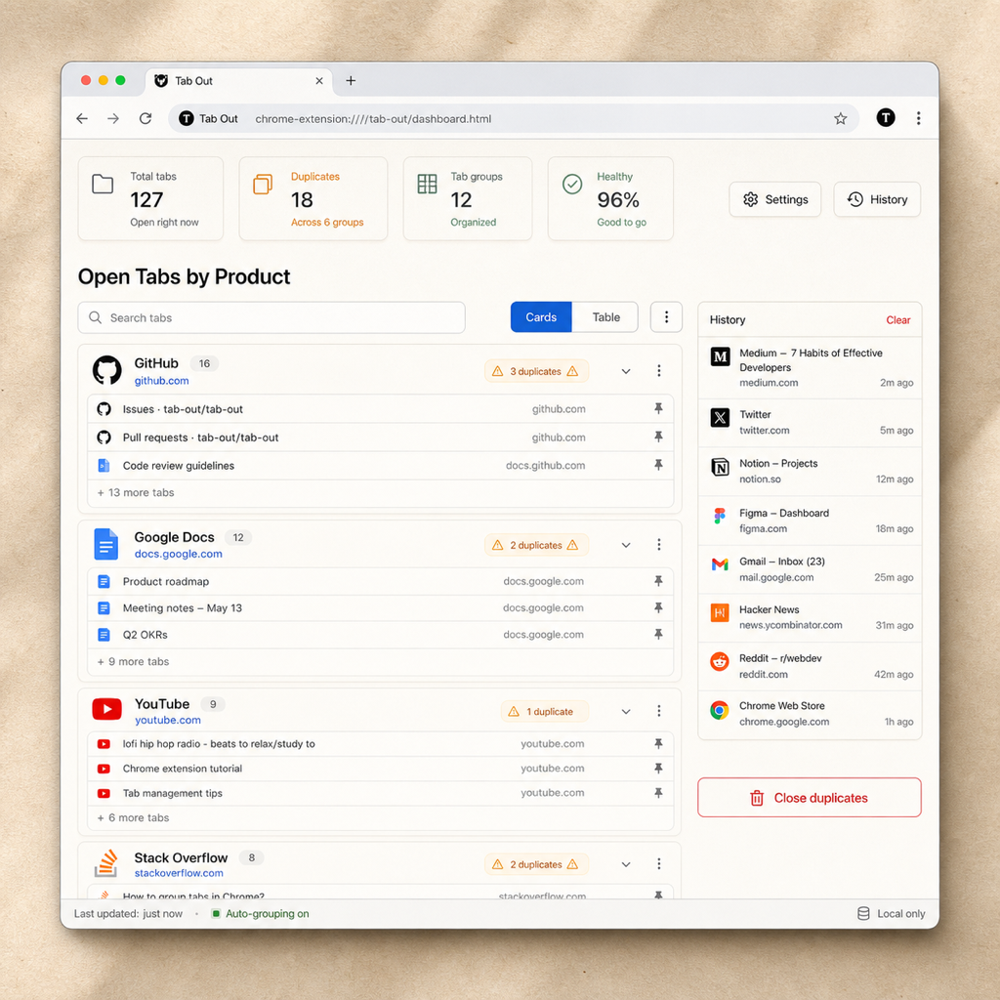

<div align="center">
  

  # Tab Organizer (标签整理器)
  
  **专为您的浏览器标签设计的本地优先控制面板。**

  [](https://opensource.org/licenses/MIT)
  []()
  []()

  ### [English](README.md) | [中文说明](README_zh.md) | [原项目 ↗️](https://github.com/OWENLEEzy/tab-out)

</div>

---

# 📖 目录
- [第一部分：用户指南](#第一部分用户指南)
  - [✨ 愿景与哲学](#-愿景与哲学)
  - [🚀 安装指南](#-安装指南)
  - [💎 核心功能](#-核心功能)
  - [⌨️ 使用技巧与快捷键](#️-使用技巧与快捷键)
  - [🔒 隐私与安全](#-隐私与安全)
- [第二部分：开发者中心](#第二部分开发者中心)
  - [🏗️ 系统架构与工程设计](#️-系统架构与工程设计)
  - [🔄 数据与生命周期](#-数据与生命周期)
  - [📂 项目结构](#-项目结构)
  - [🛠️ 开发与构建流水线](#️-开发与构建流水线)
  - [🧪 测试策略](#-测试策略)
- [🏗️ 技术栈](#️-技术栈)

---

# 第一部分：用户指南

## ✨ 愿景与哲学
**Tab Organizer** 专为那些追求整洁、美观且无干扰工作区的“标签囤积者”而生。受 **Notion** 极简优雅风格的启发，它旨在通过将注意力从水平排列的图标转向结构化、以产品为中心的控制面板，从而解决“标签疲劳”问题。

## 🚀 安装指南
1. **下载**：访问 [Releases](https://github.com/OWENLEEzy/tab-organizer/releases) 页面。
   - **⚠️ 重要**：请下载名为 **`tab-organizer-latest.zip`** 的文件。
   - **不要**直接下载底部的 `Source code (zip)`，因为那是未经编译的源码，无法直接加载。
2. **解压**：将下载的 `.zip` 文件解压到你电脑上的一个固定位置（例如“文档”或专用插件文件夹）。
3. **加载**：
   - 打开 Chrome，在地址栏输入 `chrome://extensions`。
   - 开启右上角的 **开发者模式**。
   - 点击 **加载已解压的扩展程序**，选择你刚刚解压出来的那个文件夹。
4. **固定**：将 Tab Organizer 图标固定到工具栏，以便快速访问。

## 💎 核心功能
- **智能产品分组**：使用专有的映射逻辑，按“产品”（例如：所有的 Google Docs 归为一类，所有的 GitHub 仓库归为一类）而不仅仅是原始域名对标签进行分组。
- **视觉清理**：
  - **音效与纸屑**：关闭标签时伴随高质量的微交互动效，让清理过程充满成就感。
  - **重复标签标记**：琥珀色徽章突出显示冗余标签；点击即可关闭所有多余副本。
- **多种视图**：
  - **卡片视图**：宽敞、触感十足的布局，适合视觉扫描。
  - **表格视图**：紧凑、高效的列表，适合重度用户。
- **恢复系统**：自动对打开的会话进行本地“快照”。如果不小心关闭了窗口，几秒钟内即可恢复。
- **开发者模式智能识别**：自动识别 `localhost` 和 `127.0.0.1` 项目，并按端口号自动分组。

## ⌨️ 使用技巧与快捷键
- **打开控制面板**：点击扩展图标或使用 `Cmd+Shift+K`（可在 Chrome 快捷键设置中自定义）。
- **快速搜索**：在任何地方直接输入即可立即过滤标签。
- **导航**：使用 `方向键` 在标签芯片间移动，按 `Enter` 切换到该标签。
- **整理模式**：点击顶部的“整理”按钮，通过拖拽将产品组放入自定义板块。

## 🔒 隐私与安全
Tab Organizer 坚持 **本地优先**。
- **无云端**：您的标签数据永远不会离开您的机器。
- **无追踪**：无分析、无遥测、无追踪像素。
- **权限最小化**：仅请求 `tabs` 和 `storage` 权限。

---

# 第二部分：开发者中心

## 🏗️ 系统架构与工程设计
Tab Organizer 被设计为一个健壮的、本地优先的 Chrome 扩展程序，充分利用了现代 Web 技术和 Manifest V3 (MV3) 的最佳实践。

### 1. 运行时所有权与核心支柱
项目分为三个独立的执行上下文，每个上下文都有严格的职责范围：

- **后台服务工作线程 (`src/background/`)**：
  - **无状态事件中心**：作为 Chrome 系统事件（标签创建、窗口聚焦等）的核心监听器。
  - **角标编排**：管理工具栏角标计数，采用防抖更新逻辑确保 UI 无闪烁。
  - **上下文管理**：处理“单例”控制面板模式——确保同一时间只有一个 Tab Organizer 控制面板被打开或聚焦。
- **控制面板运行时 (`src/newtab/`)**：
  - **编排器模式**：`App.tsx` 是全局状态的唯一入口。它负责执行原始浏览器标签与用户定义分组之间的“最终聚合”。
  - **模块懒加载**：像 `@dnd-kit` 这样的大型依赖仅在“整理模式”激活时才进行懒加载，以确保初始渲染时间低于 100ms。
- **存储适配器 (`src/utils/storage.ts`)**：
  - **序列化队列**：实现了一个写入队列，用于处理对 `chrome.storage.local` 的原子更新。这防止了在快速关闭标签时可能出现的数据损坏。
  - **模式规范化**：自动清理过期的产品分配，并在边界处进行旧版本数据的平滑迁移。

### 2. 状态与数据生命周期
我们采用了带有同步存储后端的 **单向数据流**。

```text
[浏览器事件] ──▶ [后台 SW] ──▶ [控制面板刷新]
                                      │
      ┌───────────────────────────────┘
      ▼
[用户操作] ──▶ [Zustand Store] ──▶ [存储适配器] ──▶ [持久化]
      ▲                                   │
      └───────────────────────────────────┘
```
- **状态事实来源**：活跃的控制面板状态存储在 **Zustand** 中。
- **持久化事实来源**：所有配置（板块、顺序、设置）都持久化在 **Chrome Storage Local** 中。
- **快照引擎**：后台例程会定期将当前的标签状态捕获为“恢复快照”，采用轻量级的 JSON 结构，并设有可配置的历史记录上限。

### 3. 逻辑与领域隔离
为了保持可测试性和代码整洁，我们进行了关注点分离：
- **`src/lib/` (纯逻辑层)**：包含“分组引擎”和“标题清洗器”。这些是纯 TypeScript 函数，负责将原始的 `chrome.tabs.Tab` 对象转换为内部的 `TabGroup` 层次结构。不依赖于 React 或 DOM API。
- **`src/stores/` (状态层)**：封装了变更逻辑。组件内部严禁直接调用 `chrome.tabs`；必须通过 Store 的 Action 进行。
- **`src/components/` (UI 层)**：纯展示组件。它们不感知 Zustand 或 Chrome API 的存在。

## 📂 项目结构
```text
src/
├── background/   # MV3 服务工作线程 (无状态事件逻辑)
├── newtab/       # React 应用 (页面编排器与组件)
│   ├── components/ # 纯 UI/UX 组件 (原子化设计)
│   └── styles/     # Tailwind v4 (设计令牌与全局 CSS)
├── stores/       # Zustand 状态库 (标签、设置、恢复、整理器)
├── lib/          # 领域逻辑 (分组引擎、快照逻辑)
├── utils/        # 基础设施 (存储适配器、Chrome API 封装)
├── types/        # 类型系统 (共享接口与枚举)
└── __tests__/    # 质量守卫 (单元测试、UI、无障碍、端到端)
```

## 🛠️ 开发与构建流水线
- **构建流水线**：Vite + CRXJS 为 MV3 开发提供了无缝体验，支持控制面板 UI 的热模块替换 (HMR)。
- **性能预算**：我们严格监控包体积，确保扩展程序保持轻量。目前主包预算控制在 500KB 以内。
- **CSS 架构**：采用 Tailwind v4 配合 Lightning CSS 实现“暖色纸张”设计系统，确保渲染速度快且间距一致。

## 🧪 测试策略
- **单元测试**：Vitest 处理核心逻辑测试（分组、URL 解析）。
- **UI/无障碍测试**：使用自定义测试环境验证组件渲染和 WCAG 兼容性。
- **端到端测试**：Playwright 在真实浏览器中模拟标签关闭和导航流程。
- **准入检查**：代码合并前必须通过 `npm run check`，强制执行 Lint、测试和包大小预算检查。

---

## 🏗️ 技术栈
| 层级 | 技术 |
| :--- | :--- |
| **框架** | React 19 + TypeScript |
| **状态** | Zustand (本地持久化) |
| **样式** | Tailwind CSS v4 + Newsreader & DM Sans |
| **构建** | Vite + CRXJS |
| **测试** | Vitest + Playwright |
| **运行时** | Chrome Extension MV3 |

---

## 🔗 致谢
灵感源自原始项目 **[Tab Out](https://github.com/OWENLEEzy/tab-out)**。为更清爽的浏览器体验而精心打造 ❤️。
